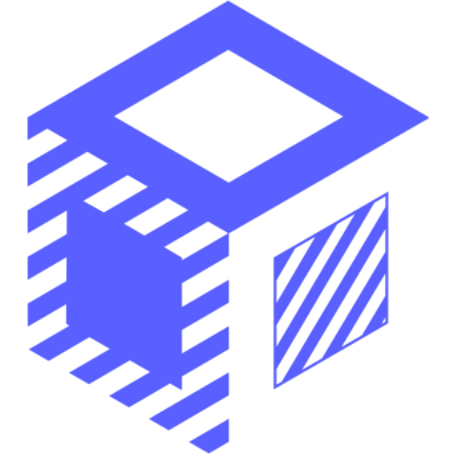
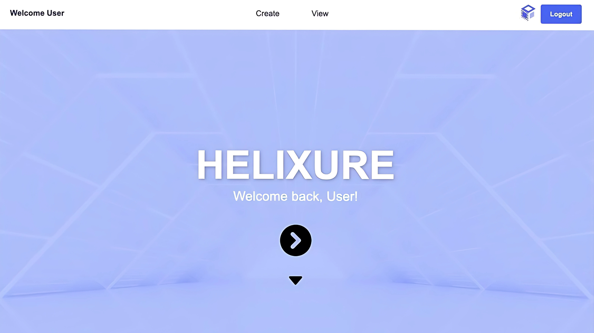
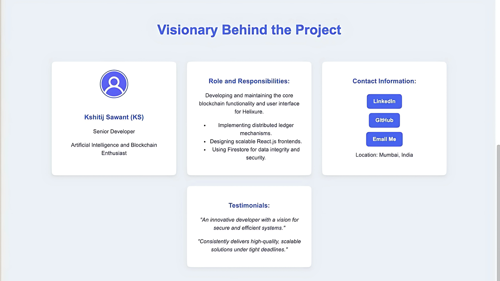
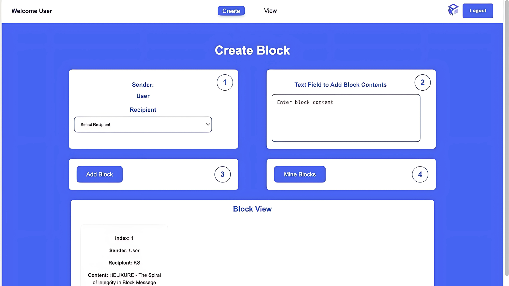
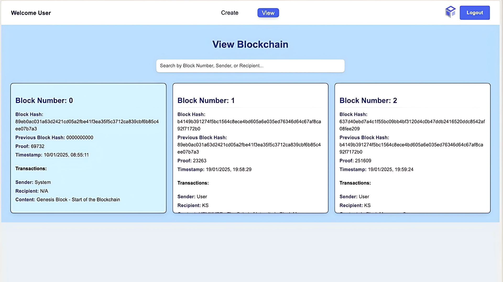
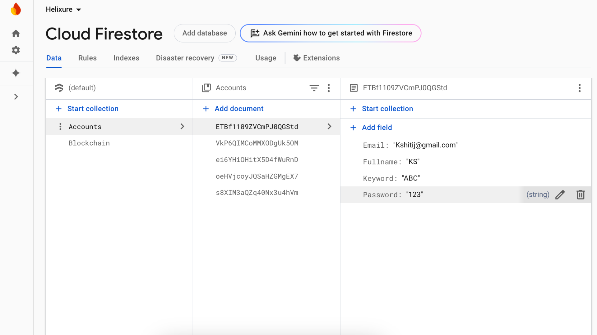
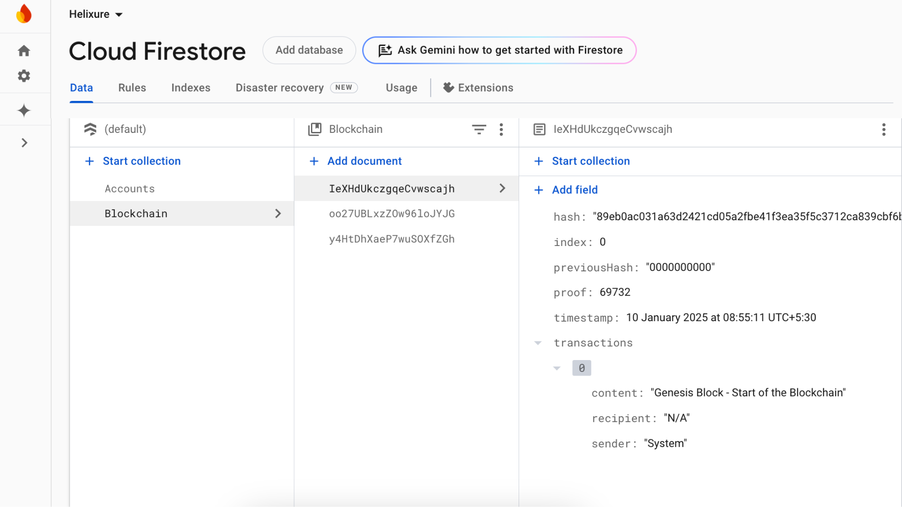

#  Helixure - Blockchain Management System

## Introduction
Helixure is a blockchain-based application designed to simplify block creation, mining, and exploration. The project focuses on user-friendly interactions with robust blockchain functionalities while ensuring data integrity using Google Firestore for secure storage.

## Features
1. **User Authentication**
   - Secure login system using email and password.
   - Account creation with recovery keyword for enhanced security.
   - Password recovery using the registered email and secure keyword.

2. **Dashboard Navigation**
   - Access to "Create Block" and "View Blockchain" functionalities.
   - Streamlined interface for seamless navigation.

3. **Block Creation and Mining**
   - Add and mine blocks with proof-of-work (PoW) validation.
   - Store blocks in Google Firestore with comprehensive metadata.

4. **Blockchain Exploration**
   - View mined blocks with metadata like hash, proof, timestamp, and transactions.
   - Search blocks by block number, sender, or recipient.

5. **Google Firestore Integration**
   - "Accounts" collection stores user credentials and recovery keywords securely.
   - "Blockchain" collection maintains mined blocks for transparency and integrity.

---

## Process Flow

### 1. User Authentication
#### Image: `src/assets/Paper Resources/Figures/3.png`
#### Image: `src/assets/Paper Resources/Figures/4.png`
- **Login Page**: Users log in with registered email and password.
- **Account Creation**: New users provide their full name, email, password, and a secure keyword for recovery.

### 2. Dashboard Navigation
#### Image: `src/assets/Paper Resources/Figures/1.png`
- **Welcome Page**: Users are greeted and can navigate to "Create Block" or "View Blockchain".

### 3. Create Block Page
#### Image: `src/assets/Paper Resources/Figures/5.png`
- **Block Creation**: Input sender (pre-filled), select recipient, and add block content.
- **Mining Process**: Validate and append the block to the blockchain using PoW.

### 4. View Blockchain
#### Image: `src/assets/Paper Resources/Figures/6.png`
- **Blockchain Explorer**: View mined blocks with detailed metadata.
- **Search Functionality**: Filter blocks by block number, sender, or recipient.

### 5. Google Firestore: Accounts Collection
#### Image: `src/assets/Paper Resources/Figures/7.png`
- **User Storage**: Stores user credentials, including email, password, and recovery keyword.

### 6. Google Firestore: Blockchain Collection
#### Image: `src/assets/Paper Resources/Figures/8.png`
- **Blockchain Storage**: Mined blocks are stored with their hash, index, proof, timestamp, and transaction details.

---

## Technologies Used
- **Frontend**: React.js for a responsive and intuitive user interface.
- **Backend**: Proof-of-work algorithm for mining.
- **Database**: Google Firestore for secure and reliable data storage.

---

## Getting Started

### Prerequisites
- Node.js installed on your system.
- Google Firestore set up with collections: `Accounts` and `Blockchain`.

### Installation
1. Clone the repository:
   ```bash
   git clone https://github.com/your-repo/helixure.git
   ```
2. Navigate to the project directory:
   ```bash
   cd helixure
   ```
3. Install dependencies:
   ```bash
   npm install
   ```
4. Start the application:
   ```bash
   npm start
   ```

---

## Usage
1. **Account Creation**: Sign up with your details.
2. **Login**: Access your account using email and password.
3. **Create Block**: Add and mine blocks by providing content and recipient.
4. **View Blockchain**: Explore the blockchain and search for specific blocks.

---

## Screenshots

### 1. Welcome Page


### 2. Visionary Behind the Project


### 3. Create Block Page


### 4. View Blockchain Page


### 5. Firestore - Accounts Collection


### 6. Firestore - Blockchain Collection


---

## Contributing
Contributions are welcome! Feel free to submit a pull request or open an issue for any bugs or feature requests.

---

## License
This project is licensed under the MIT License. See the [LICENSE](LICENSE) file for details.

---

## Contact
For any queries or suggestions, please contact:
- **Name**: Kshitij Sawant
- **LinkedIn**: [Kshitij's LinkedIn](https://www.linkedin.com/in/kshitijksawant/)
- **GitHub**: [Kshitij's GitHub](https://github.com/KshitijSawant1)
- **LinkTree**: [Kshitij's LinkTree](https://linktr.ee/kshitij_sawant)

---
